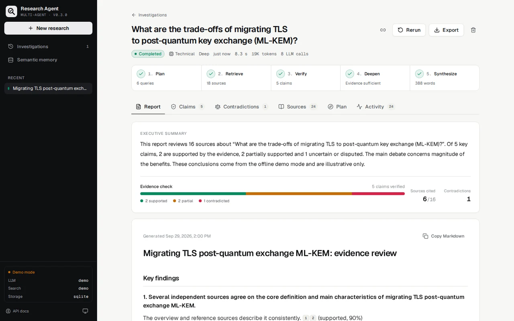
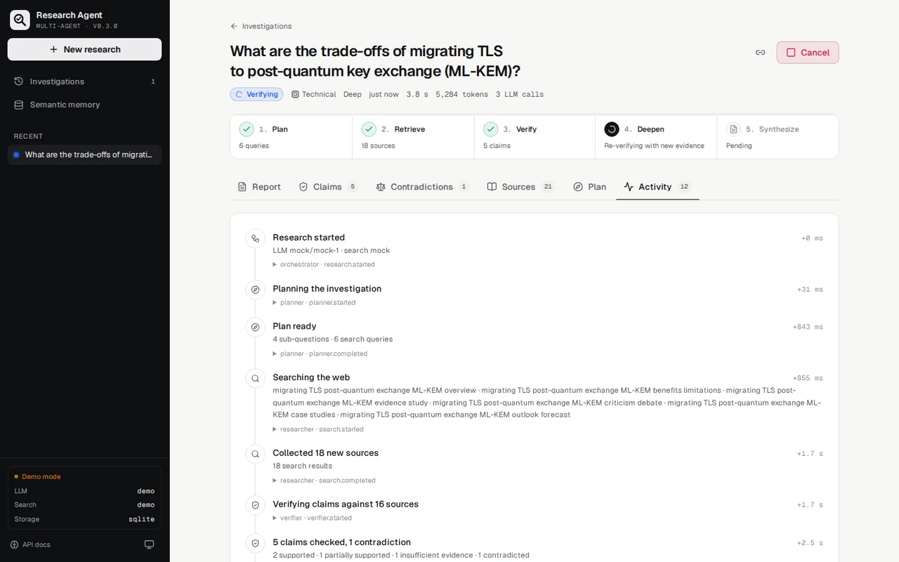
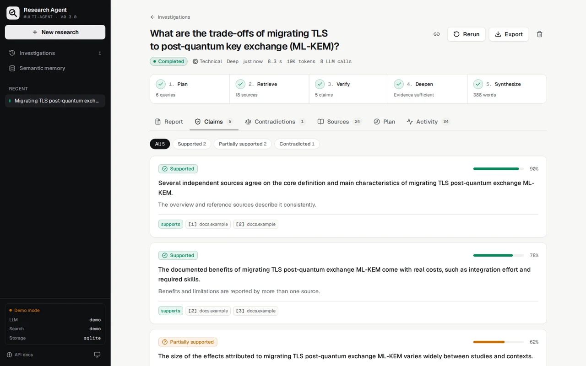
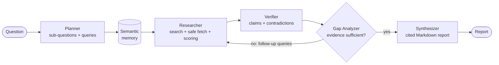

<div align="center">

# AI Research Agent

**Multi-agent research platform: plans an investigation, collects sources, verifies every claim, flags contradictions and writes a report where each statement links back to its evidence.**

[English](#english) • [Français](#français)

[](https://github.com/looayz/AI-research-agent/actions/workflows/ci.yml)
[](https://nextjs.org/)
[](https://fastapi.tiangolo.com/)
[](https://python.org)
[](LICENSE)



</div>

---

## English

### Features

- **Five cooperating agents** — Planner, Researcher, Verifier, Gap Analyzer and Synthesizer — orchestrated as a pipeline you can watch live.
- **Real depth modes**: *quick* (one search pass), *standard* (one gap-analysis round) and *deep* (up to three rounds: find gaps → follow-up searches → re-verify everything).
- **Claim verification**: each claim is marked supported / partially supported / contradicted / insufficient evidence, with a confidence score and the exact sources on each side. Contradictions between sources are explained.
- **Grounded reports**: Markdown report with clickable `[n]` citations that only point to sources that were actually collected; invalid references are removed.
- **Human in the loop**: exclude a source, then regenerate the report — claims are re-verified without it.
- **Provider-agnostic**: OpenAI, Anthropic (Claude), Google Gemini, Groq, OpenRouter, Ollama or any OpenAI-compatible server; Tavily, SearXNG, DuckDuckGo, Wikipedia and arXiv search (combinable).
- **Offline demo mode** by default: question-aware mock providers, no API key needed.
- **Semantic memory**: sources from past investigations are recalled automatically and searchable.
- **Safe web fetching**: SSRF protection (DNS validation at connect time, redirect checks, size caps).
- **Live UI**: Server-Sent Events with resume, cancel, rerun, history, exports (Markdown, JSON, print/PDF), dark mode, mobile layout.

<p align="center">
  
  
</p>

### Quick start

Requirements: **Python 3.11+** and **Node.js 20.9+**.

```bash
./start.sh        # macOS / Linux
start.bat         # Windows (double-click works too)
```

The script creates `.env` from `.env.example`, installs the dependencies and starts the API (`:8000`) and the web app (`:3000`). Open **http://localhost:3000**. API docs: http://localhost:8000/api/docs.

With Docker (PostgreSQL + Redis included):

```bash
cp .env.example .env     # optional
docker compose up --build -d
```

Hot-reload development in Docker: `docker compose -f docker-compose.yml -f docker-compose.dev.yml up --build`.

### Configure real providers

The app starts in **demo mode**. Edit `.env` (see `.env.example` for every option):

| Setting | Values |
|---|---|
| `LLM_PROVIDER` | `openai`, `anthropic`, `gemini`, `groq`, `openrouter`, `ollama`, `mock` |
| `LLM_MODEL` | empty = provider default (`gpt-4o-mini`, `claude-sonnet-5-5`, `gemini-2.5-flash`, `llama-3.3-70b-versatile`, `llama3.1`) |
| API keys | `OPENAI_API_KEY`, `ANTHROPIC_API_KEY`, `GEMINI_API_KEY`, `GROQ_API_KEY`, `OPENROUTER_API_KEY` |
| `LLM_BASE_URL` | any OpenAI-compatible endpoint (LM Studio, vLLM…) |
| `SEARCH_PROVIDER` | `tavily`, `searxng`, `duckduckgo`, `wikipedia`, `arxiv`, `mock` — comma-separated to combine, e.g. `tavily,arxiv` |
| `TAVILY_API_KEY`, `SEARXNG_BASE_URL` | for Tavily / your SearXNG instance |

No key at all? `SEARCH_PROVIDER=wikipedia,duckduckgo` with `LLM_PROVIDER=ollama` runs fully locally. The sidebar shows which providers are active.

### How it works



| Depth | Queries | Gap-analysis rounds | Sources given to verifier / synthesizer |
|---|---|---|---|
| quick | 2–3 | 0 | 8 |
| standard | 3–4 | 1 | 12 |
| deep | 4–6 | up to 3 | 16 |

Every step emits events (stored in the database and streamed over SSE), which drive the pipeline view and the activity timeline. Sources are scored on authority, match with the question, search rank, content depth and freshness; the breakdown is visible in the UI.

### Repository layout

```
apps/api/    FastAPI backend: agents, providers, orchestrator, SSE, tests
apps/web/    Next.js 16 frontend (proxies /api to the backend)
docs/        Deployment guide, code review, screenshots
docker-compose.yml / docker-compose.dev.yml
start.sh / start.bat
```

### API

| Method | Endpoint | Description |
|---|---|---|
| `GET` | `/api/health` (also `/health`) | Status, active providers, storage |
| `POST` | `/api/research` | Start a research `{question, depth, domain}` |
| `GET` | `/api/research?q=&status=&limit=&offset=` | History (summaries with counts) |
| `GET` | `/api/research/{id}` | Full detail: plan, queries, sources, claims, contradictions, events, report |
| `GET` | `/api/research/{id}/events` | Live SSE stream (supports `Last-Event-ID` / `?after=`) |
| `POST` | `/api/research/{id}/cancel` | Cancel a running research |
| `POST` | `/api/research/{id}/rerun` | Start a new run with the same parameters |
| `POST` | `/api/research/{id}/resynthesize` | Re-verify and rewrite the report from the non-excluded sources |
| `POST` | `/api/research/{id}/sources/{sid}/exclude` · `/include` | Exclude / restore a source |
| `GET` | `/api/research/{id}/sources/{sid}` | Full text of a source |
| `GET` | `/api/research/{id}/export?format=md\|json` | Download the report or all data |
| `DELETE` | `/api/research/{id}` | Delete (cancels it first if running) |
| `POST` | `/api/memory/search` | Similarity search across past sources |

### Development

```bash
# Backend
cd apps/api
python -m pip install -r requirements-dev.txt
ruff check . && ruff format --check .
pytest                      # 100+ tests, no network; TEST_DATABASE_URL=postgresql+asyncpg://… for PostgreSQL

# Frontend
cd apps/web
npm ci && npm run lint && npm run typecheck && npm run build
```

CI runs the backend tests on SQLite and PostgreSQL, the frontend checks, and builds and smoke-tests the Docker images.

### Security notes

- There is **no authentication**: anyone who can reach the app can start researches (and spend your API credits). Deploy it behind an authenticating proxy (Coolify/Traefik basic auth, Cloudflare Access, a VPN…). See [docs/COOLIFY_DEPLOYMENT.md](docs/COOLIFY_DEPLOYMENT.md).
- Pages are fetched from URLs returned by search engines, so they are treated as hostile: only public addresses are reachable (checked at connect time and on every redirect), responses are size-capped, and content is never executed.
- Model output is rendered as Markdown without raw HTML; links are restricted to http(s).

### Limitations

- Semantic memory uses local lexical embeddings (hashed words and bigrams): no external model, but synonyms are not matched.
- Report quality depends on the LLM and on what the search provider returns; always check the cited sources.
- PDFs are not parsed (their search snippet is used when available).

A detailed review of the first version and of the changes is available (in French) in [docs/REVIEW.md](docs/REVIEW.md).

---

## Français

Plateforme de recherche multi-agents : elle planifie l'enquête, collecte des sources, **vérifie chaque affirmation**, repère les contradictions et rédige un rapport dont chaque phrase renvoie à ses preuves.

### Fonctionnalités

- **Cinq agents** (planificateur, chercheur, vérificateur, analyseur de lacunes, synthétiseur) dont on suit le travail en direct.
- **Vraies profondeurs** : *quick* (une passe), *standard* (un tour d'analyse des lacunes), *deep* (jusqu'à trois tours : lacunes → recherches complémentaires → nouvelle vérification).
- **Vérification des affirmations** : statut (étayée, partiellement étayée, contredite, preuves insuffisantes), confiance, sources pour et contre ; les contradictions sont expliquées.
- **Rapport sourcé** : citations `[n]` cliquables, uniquement vers des sources réellement collectées.
- **Contrôle humain** : excluez une source puis régénérez le rapport.
- **Multi-fournisseurs** : OpenAI, Anthropic (Claude), Gemini, Groq, OpenRouter, Ollama ; recherche Tavily, SearXNG, DuckDuckGo, Wikipédia, arXiv.
- **Mode démo hors ligne** par défaut, sans clé d'API, qui s'adapte à la question (FR/EN).
- **Mémoire sémantique**, **récupération web sécurisée** (anti-SSRF), **interface temps réel** (SSE), historique, exports, thème sombre, mobile.

### Démarrage rapide

Prérequis : **Python 3.11+** et **Node.js 20.9+**.

```bash
./start.sh        # macOS / Linux
start.bat         # Windows (double-clic possible)
```

Le script crée `.env`, installe les dépendances et lance l'API (`:8000`) et l'interface (`:3000`). Ouvrez **http://localhost:3000**.

Avec Docker (PostgreSQL + Redis inclus) : `docker compose up --build -d`.

### Passer en recherche réelle

Dans `.env` : choisissez `LLM_PROVIDER` (`openai`, `anthropic`, `gemini`, `groq`, `openrouter`, `ollama`) avec la clé correspondante, et `SEARCH_PROVIDER` (`tavily`, `searxng`, `duckduckgo`, `wikipedia`, `arxiv`, combinables avec des virgules). Sans aucune clé : `SEARCH_PROVIDER=wikipedia,duckduckgo` et `LLM_PROVIDER=ollama` fonctionnent entièrement en local. Mettez `WIKIPEDIA_LANG=fr` pour la Wikipédia francophone. Le rapport est rédigé dans la langue de la question.

### Sécurité

L'application **n'a pas d'authentification** : sur un serveur, placez-la derrière un proxy authentifiant (basic auth Coolify/Traefik, Cloudflare Access, VPN). Le guide [docs/COOLIFY_DEPLOYMENT.md](docs/COOLIFY_DEPLOYMENT.md) détaille le déploiement.

### Revue de code

La revue complète de la première version (générée par Gemini) et la liste des corrections se trouvent dans [docs/REVIEW.md](docs/REVIEW.md).

---

## License

MIT — see [LICENSE](LICENSE).
